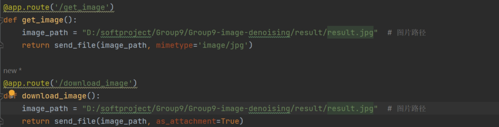

## 一、基本情况

### 团队ID

09

### 组长博客

链接：[[Elecmark_博客](https://elecmark.github.io/)]

### 小组成员

- 普典衡
- 司宇萌
- 孙文秀
- 王诗梦
- 王菲

## 二、冲刺概况汇报

### 普典衡

- 过去完成的任务：
  - 删除了所有冗余文件，完成了下载功能，优化了所有UI，加入了介提示等等。调整了按钮布局，添加了开发者信息，对网站流程进行了优化，可以作为正式版
  - 
- 接下来的计划：
  - 继续优化网页介绍UI和功能等等
- 遇到的困难：
  - 图片模型去噪完之后没有显示到前段，路径丢失与函数调用关系的调试。
- 收获和疑问：
  - 学习了前端美化，以及前后端接口使用，学习了pycharm，以及前端CSS，HTML，JavaScript的知识

### 司宇萌

- 过去完成的任务：
  - 完成了前端，实现了上传显示下载等功能，增加了进度条和去噪时锁定页面的功能。 接下来的计划：继续优化模型。
  - 
- 接下来的计划：
  - 继续优化。
- 遇到的困难：
  - 在实现按钮的过程中，出现了找不到位置的问题，之后模型运行成功，但是一直没有自动更新显示去噪后的图片。
- 收获和疑问：
  - 学习了pycharm，学习了HTML等前端知识，探索了滚动式长页面网页的实现。

### 孙文秀

- 过去完成的任务：
  - 完成CBDnet模型训练，实现图片去噪，协助负责后端的同学进行模型的调用。
  - 
- 接下来的计划：
  - 继续优化模型。
- 遇到的困难：
  - 一开始模型在只有CPU的电脑上运行会失败，后来在学长的帮助下将这个问题成功解决。还有就是我的fork出现一些问题，push不上去，害怕重新pull下来会覆盖掉我写的文件，选择将文件打包发给组内同学。
- 收获和疑问：
  - 学习到了CBDnet和模型调用的有关知识。

### 王诗梦

- 过去完成的任务：
  - 将前端上传的图片保存到images文件夹并将其重命名为original.jpg；修改代码使前端的任何格式图片都可被模型识别并处理；将模型处理的结果图片改成只有处理后效果的图片并命名为result存放到result文件夹中以供前端调用显示
  - 
- 接下来的计划：
  - 继续完善优化代码
- 遇到的困难：
  - 前端图片保存到本地有点小问题，但顺利解决
- 收获和疑问：
  - 学习了后端处理图片以及保存路径的相关知识

### 王菲

- 过去完成的任务：
  - 将前端上传的图片保存到images文件夹并重命名为original.jpg；修改代码使前端的任何格式图片都可被模型识别并处理；将模型处理的结果图片命名为result并存放到result文件夹中以供前端调用显示
  - 
- 接下来的计划：
  - 继续完善优化代码
- 遇到的困难：
  - 前端图片保存到本地有点小问题，但顺利解决
- 收获和疑问：
  - 学习了后端python的相关知识

## 三、冲刺成果展示

### 最新成果展示

- 网站前端改为滚动式，修改了背景，添加说明UI，美化了界面，结构重新设计
- 
- 
- 

### 站立会议合照

- 

### 会议时间、地点、内容记录

- **时间**：2023.12.31 23:00

- **地点**：海底捞

- **内容**：

  #### 1. 项目结项总结

  - 对项目从启动到结项的整体进展进行了回顾，强调了团队在各个阶段所取得的成果和学习的经验。

  #### 2. 关键成就突出

  - 着重讨论了项目中的关键成就，如前端界面的创新设计、后端功能的强化以及整体用户体验的显著提升。
  - 强调了CBDnet模型在项目中的成功应用，及其对图片处理效果的显著提升。

  #### 3. 技术挑战与团队克服

  - 回顾了项目过程中遇到的技术挑战，如模型的选择和优化、前后端的有效集成等，并讨论了团队如何共同解决这些问题。

  #### 4. 团队合作与个人成长

  - 着重强调了团队合作在项目成功中的关键作用，分享了通过项目成员在技术、协作和问题解决方面的成长。

  #### 5. 项目的长期影响与未来展望

  - 探讨了项目对团队成员未来职业生涯的潜在影响，以及所学技能和经验如何在未来的工作中得到应用。
  - 对未来可能的项目迭代和技术发展进行了展望。

  #### 6. 结项感想与感谢

  - 成员们分享了对项目结项的感想，表达了对团队努力和成就的认可。
  - 对参与项目的每位成员、指导老师和合作伙伴表示感谢。

  #### 7. 会议总结

  - 回顾了本次项目的整体旅程，从启动到结项，每个阶段的学习和成长。
  - 强调了团队合作和共同努力在实现项目目标中的重要性，并对团队成员在未来的挑战中取得的成功表示乐观。
