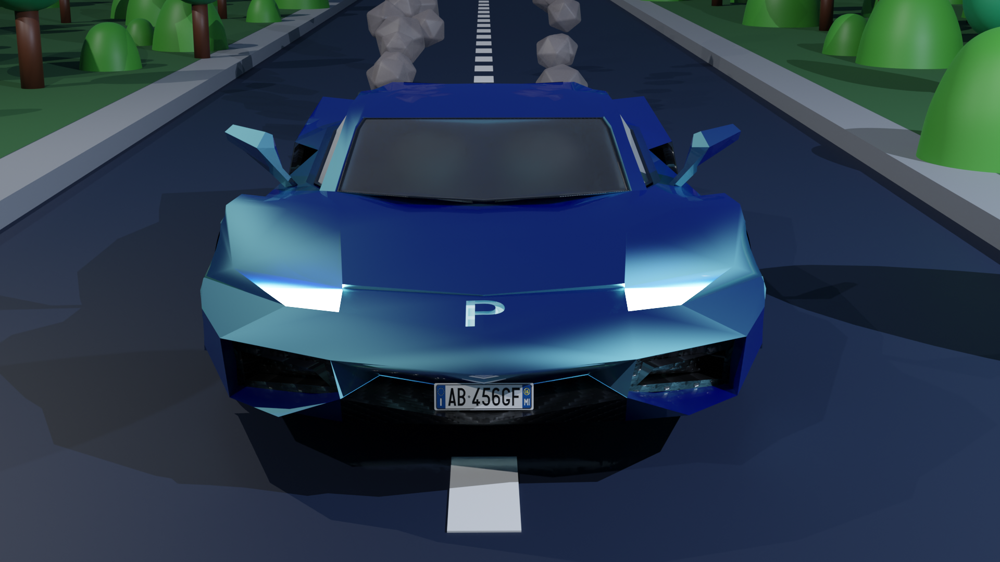
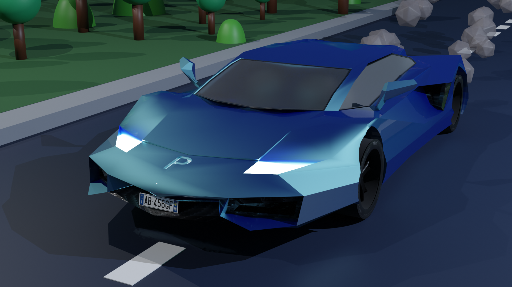
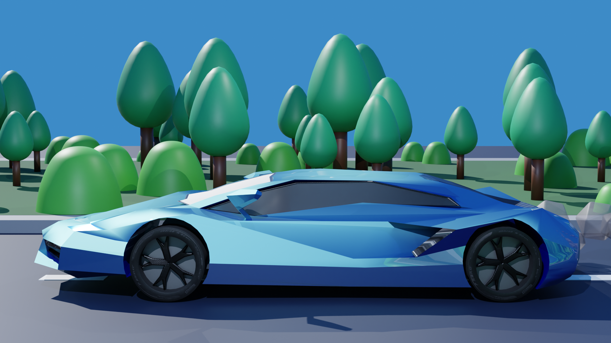
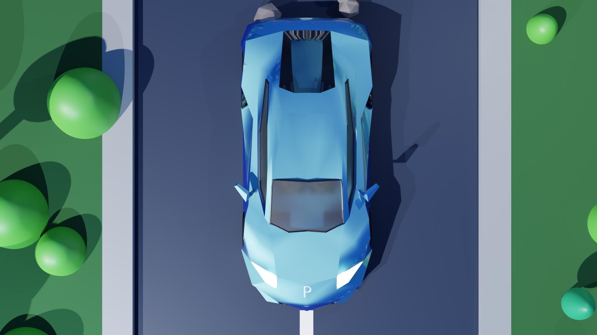
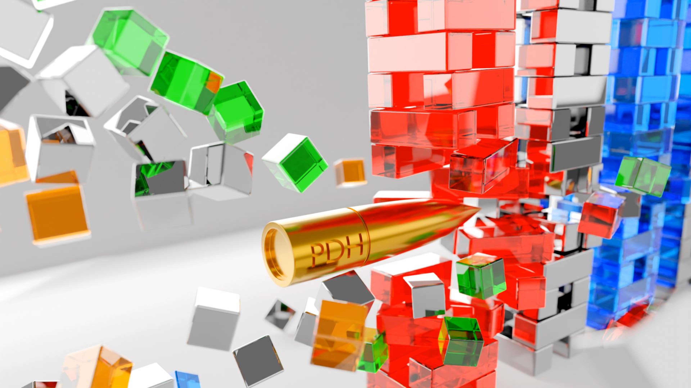

### 三兄弟建模（几何）

### 积木建模/动画（动画）

【Blender积木】 https://www.bilibili.com/video/BV15K421x7aj/?share_source=copy_web

<iframe 
src="//player.bilibili.com/player.html?aid=1701692717&bvid=BV15K421x7aj&cid=1463230031&p=1" scrolling="no" border="0" 
frameborder="no" framespacing="0" allowfullscreen="true" style="position: absolute; width: 100%; 
height: 100%; left: 0; top: 0;"> </iframe>

### 金币基站建模（金属光泽材质）

### 跑车建模/动画（复杂图形建模与循环动画）

【Blender跑车】 https://www.bilibili.com/video/BV1Mj421f71M/?share_source=copy_web

<iframe 
src="//player.bilibili.com/player.html?aid=1651706227&bvid=BV1Mj421f71M&cid=1463231676&p=1" scrolling="no" border="0" 
frameborder="no" framespacing="0" allowfullscreen="true" style="position: absolute; width: 100%; 
height: 100%; left: 0; top: 0;"> </iframe>

### 荧光树桩建模（半透明材质）

### 子弹时间建模/动画（物理效果模拟）

【Blender子弹时间】 https://www.bilibili.com/video/BV1xW421c7ux/?share_source=copy_web

<iframe 
src="//player.bilibili.com/player.html?aid=1851675396&bvid=BV1xW421c7ux&cid=1463235980&p=1" scrolling="no" border="0" 
frameborder="no" framespacing="0" allowfullscreen="true" style="position: absolute; width: 100%; 
height: 100%; left: 0; top: 0;"> </iframe>

### 离散猴头（几何节点）

【Blender猴头】 https://www.bilibili.com/video/BV1Uj421Z7Nc/?share_source=copy_web

<iframe 
src="//player.bilibili.com/player.html?aid=1651642308&bvid=BV1Uj421Z7Nc&cid=1463239128&p=1" scrolling="no" border="0" 
frameborder="no" framespacing="0" allowfullscreen="true" style="position: absolute; width: 100%; 
height: 100%; left: 0; top: 0;"> </iframe>
