## (a)软件功能说明


①线上歌单的获取和保存，加载进度条

②本地歌单的创建和保存（包括歌单封面选择，音乐的添加和删除），本地歌单的修改（封面，重命名），删除歌单

③播放器功能，双击选中歌曲播放（默认循环播放），停止，上一首，下一首，随机播放，顺序播放，单曲循环

④音乐播放进度条，当前播放的显示


## (b)软件架构设计


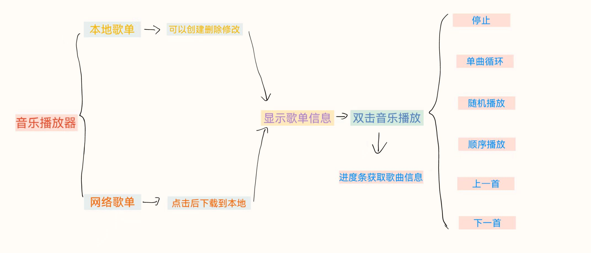


## (c)软件模块设计与实现


### ①面板GUI(gui包)：

将五个小面板链接进主面板里，播放器的功能按钮链接进MusicPlayerBlock，互相需要调用的也作为对象传入了。

#### 关键代码：

```java
    MusicPlayerBlock musicPlayerBlock = new MusicPlayerBlock(musicSheets);

    MusicSheetDisplayBlock musicSheetDisplayBlock = new MusicSheetDisplayBlock();

    SharedMusicSheetBlock sharedMusicSheetBlock = new SharedMusicSheetBlock(musicSheets, musicPlayerBlock, musicSheetDisplayBlock);

    LocalMusicSheetBlock localMusicSheetBlock = new LocalMusicSheetBlock(musicSheets, musicPlayerBlock, musicSheetDisplayBlock);

    MusicSheetManagementBlock musicSheetManagementBlock = new MusicSheetManagementBlock(localMusicSheetBlock, sharedMusicSheetBlock);
```

遇到的问题：这一块遇到的问题太多了，各个面板之间的互相作用，互相刷新显示，为此改了无数个版本，好在最后算是形成了相对满意的样子，各个面板直接也没有明显bug。关键代码太多在此只写了实例化的代码展现每个面板之间的联系


### ②网络(httpclient包)


详细过程：主要参考老师的代码。

```java
    其中JSONObject mumObj = new JSONObject(jms.get("musicItems"));
    改为了JSONObject mumObj = (JSONObject) jms.get("musicItems");
```

解决了musicItems从线上获取为空的情况


### ③(model包)

详细过程：Music类是music的信息的存储，包括时长，作者，歌名等信息及这些信息的获取函数。MusicSheet是歌单信息的存储及歌单信息的获取方法。主要都在NewMP3Playe里调用。

#### 关键代码：

```java
    public Music(String filePath, String fileName) {
        this.filePath = filePath;
        this.fileName = fileName;
        try {
            File file = new File(filePath);
            AudioFile audioFile = AudioFileIO.read(file);
            Tag tag = audioFile.getTag();
            title = tag.getFirst(FieldKey.TITLE);
            if (title == null || title.isEmpty()) {
                title = fileName.replaceAll("\\.mp3$", "");
            }
            artist = tag.getFirst(FieldKey.ARTIST);
            if (artist == null || artist.isEmpty()) {
                artist = "未知歌手";
            }
            musicduration = Duration.seconds(audioFile.getAudioHeader().getTrackLength());
            long minutes = (long) musicduration.toMinutes();
            long seconds = (long) (musicduration.toSeconds() % 60);
            duration = String.format("%02d:%02d", minutes, seconds);
        } catch (Exception e) {
            System.out.println(fileName);
            System.out.println("Error occurred while processing file: " + filePath);
            e.printStackTrace();
            // 删除文件
            File fileToDelete = new File(filePath);
            fileToDelete.delete();
        }
    }
```


### ④(soundmaker包)


详细过程：实际上只有NewMP3Player实装。NewMP3Player中用来实现播放器各项按钮的功能。NewMP3Player与MusicPlayerBlock互相联系。在MusicPlayerBlock里建立显示歌单内容的表格，并设置鼠标点击监听器，通过点击获取歌单和音乐的信息。

NewMP3Player里有

playButton（播放）

stopButton（停止）

prevButton（上一首）

nextButton（下一首）

sequenceButton（顺序播放）

randomButton（随机播放）

slider（进度条）

loopButton（循环播放）

为了实现代码复用，增添了stopPlayer和musicSequence的方法。

双击选中歌曲，会启动播放按钮，调用playmusic方法，在playmusic里根据布尔变量来判断是否进行随机播放和单曲循环，否则默认单曲循环。在进度条里通过player.getPosition获取歌曲进度。

遇到的问题：在写暂停的时候遇到了很多的问题，花费了很多的时间，用playThread和contralThread来实现，但是暂停时总是会出现线程冲突的问题。最后放弃了。

由于播放器库没有setPosition之类的按钮，所以没有实现拖动进度条实现控制音乐进度。


#### 关键代码：

```java
		playThread = new Thread(new Runnable() {
            @Override
            public void run() {
                try {
                    while (!isStopped) {
                        if (!isPaused && player != null) {
                            player.play();
                            if (isLooping && player.isComplete()) {
                                // 当音乐播放完成且isLooping为true时，重新开始播放当前音乐
                                if(isLooping) {
                                    player.close();
                                    BufferedInputStream buffer = 
                                    new BufferedInputStream(new FileInputStream(filename));
                                    player = new Player(buffer);
                                }
                                else {
                                    sequenceButton.doClick();
                                }
                            }
                        }
                    }
                }
                catch (Exception e) {
                    e.printStackTrace();
                } finally {
                    if (player != null) {
                        player.close();
                    }
                }
            }
        });
        playThread.start();
```

实现每次播放音乐都创建一个新的音乐线程，不与主线程冲突。


## (d)软件界面及功能展示


### **开启后的界面**

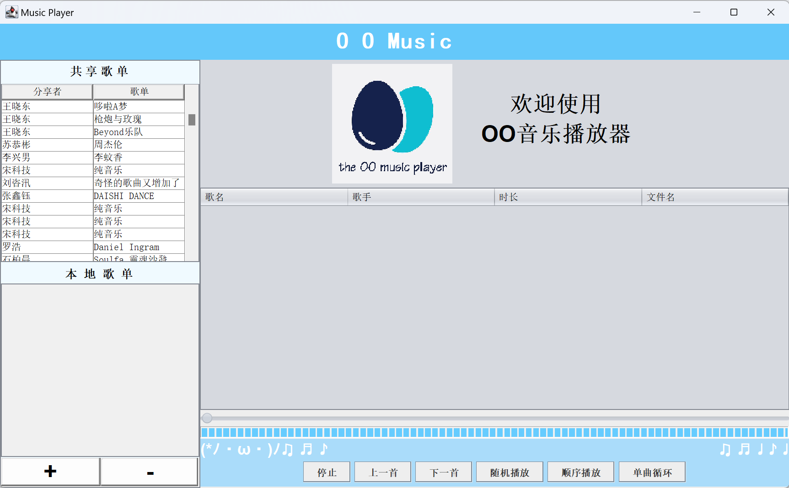

### **线上功能展示**
（如果服务器连接失败20秒后会进入本地模式（共享歌单无信息））**：**

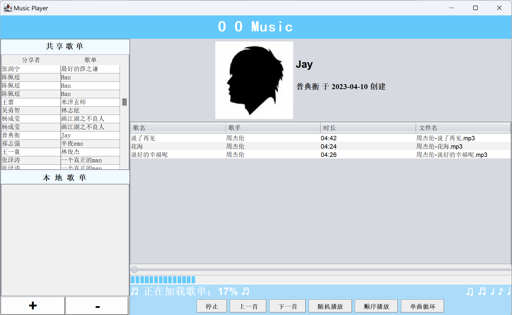

单击共享歌单列表之后右侧歌曲列表面板会刷新，右侧歌单封面，歌单名字，创建者和创建时间都会显示下方会显示歌单加载进度条，歌曲会一首一首显示出来（只要显示就可以双击播放），如果有未下载完成的损坏MP3文件（如上次下载到一半关闭了程序导致）的会自检后删除损坏文件重新下载

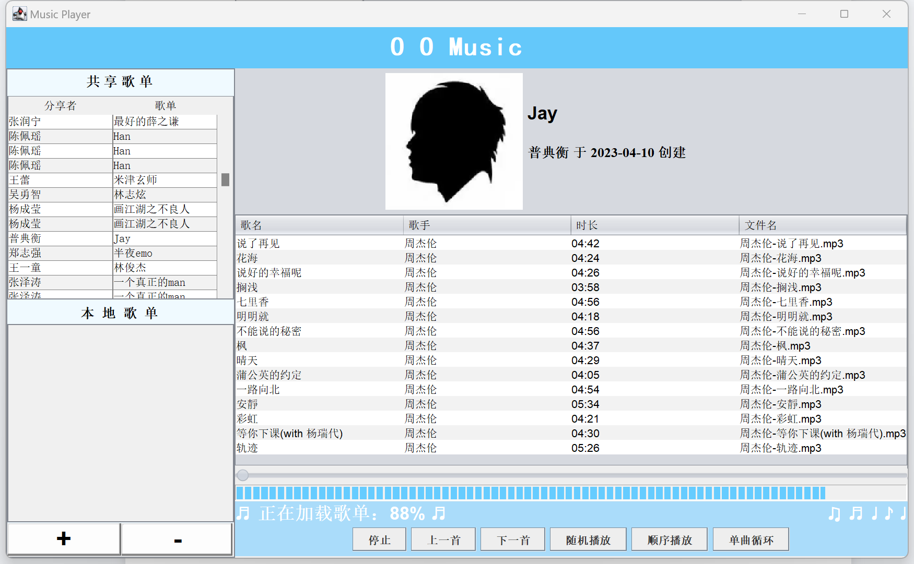

加载进度条会随着歌曲一首首显示实时更新

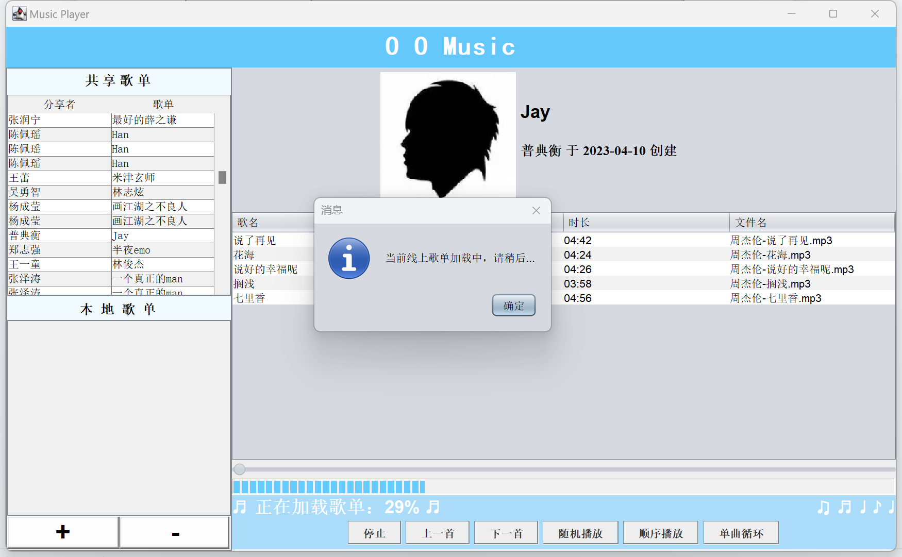

若在歌单加载过程中点击其他歌单或本地歌单添加按钮会弹出提示

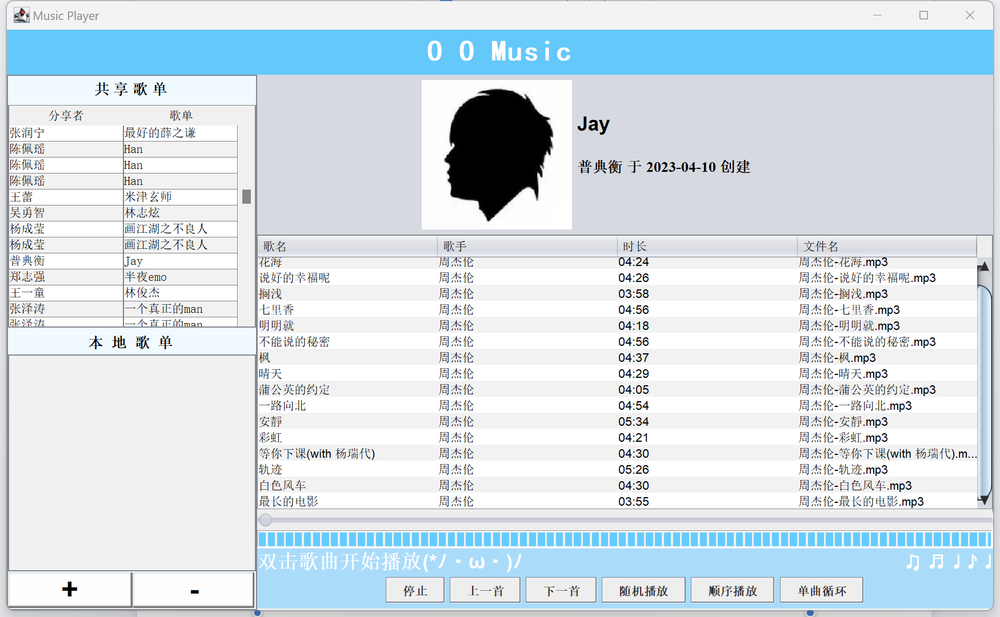

歌单加载完成后会提示“双击歌曲开始播放”

### **线下功能展示**

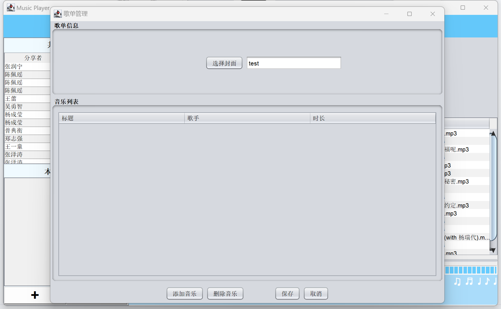

为本地歌单提供两个互动按钮

#### “+”新建歌单

点击后弹出创建歌单面板，输入歌单名后弹出下一个详细编辑面板


在此弹窗歌单依然可以修改名字，还可以选择歌单封面（若不选择则为默认的播放器logo），添加/删除音乐

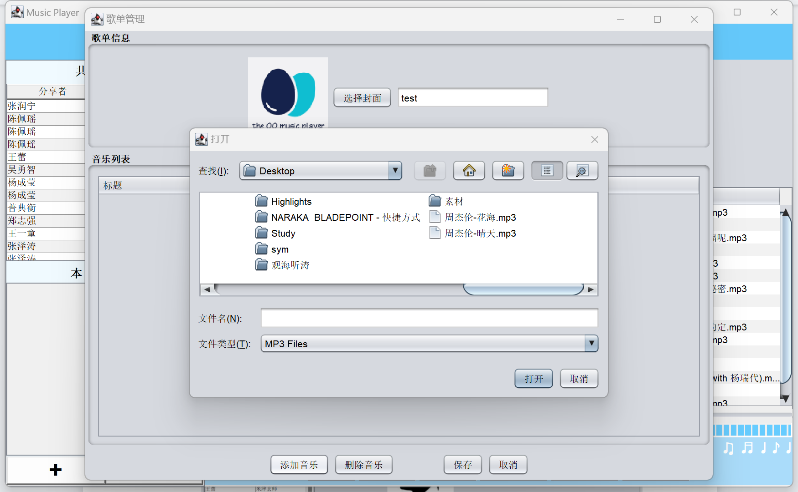

从电脑文件中选择封面和MP3类型的音乐

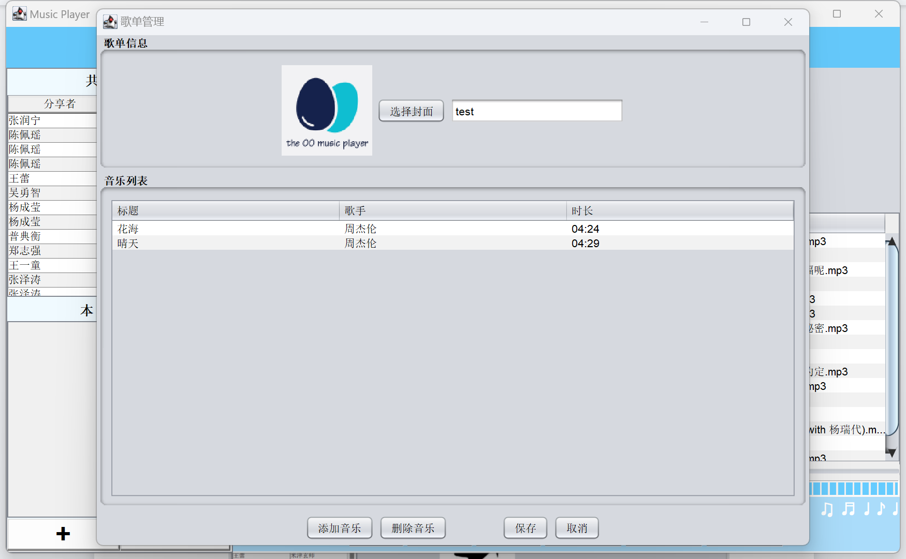

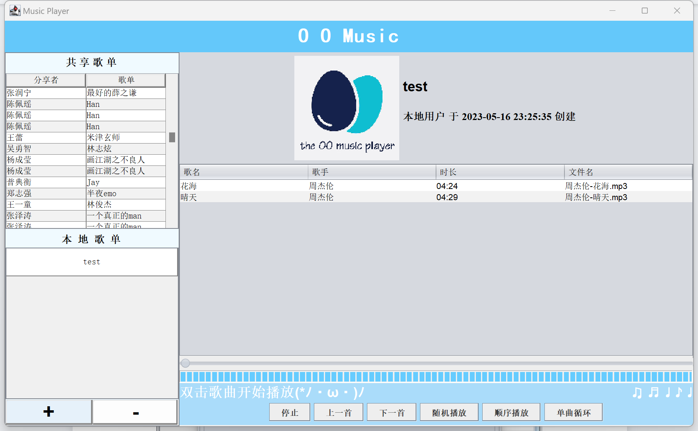

点击保存后在本地歌单面板显示刚刚创建的面板，点击后效果与线上歌单一致

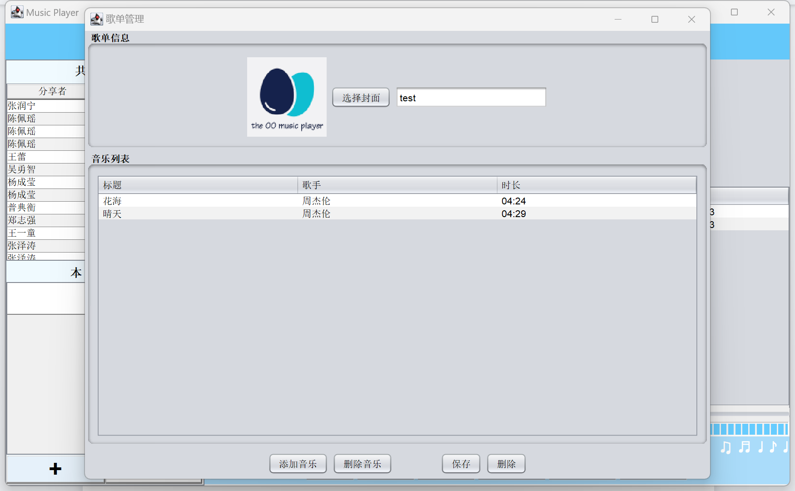

#### “-”编辑歌单

选中本地歌单中的某歌单后会打开编辑面板，与创建面板功能相似，不过“取消”按钮变味了“删除”，点击删除按钮后歌单从test中删除

### **播放功能展示**

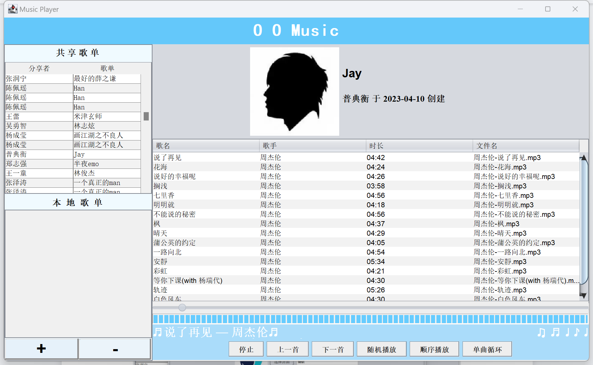

双击歌曲开始播放，播放进度条会随着歌曲推进

默认本歌单顺序列表循环播放

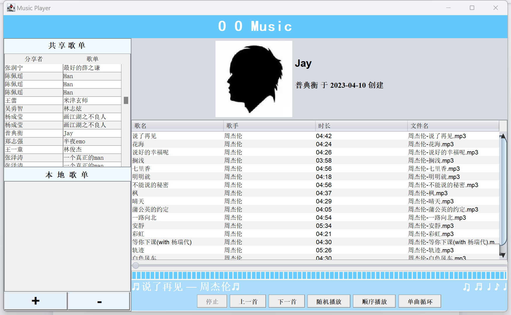

点击停止会终止当前歌曲播放，播放进度条归0，“停止”按钮也会变灰为不可用状态

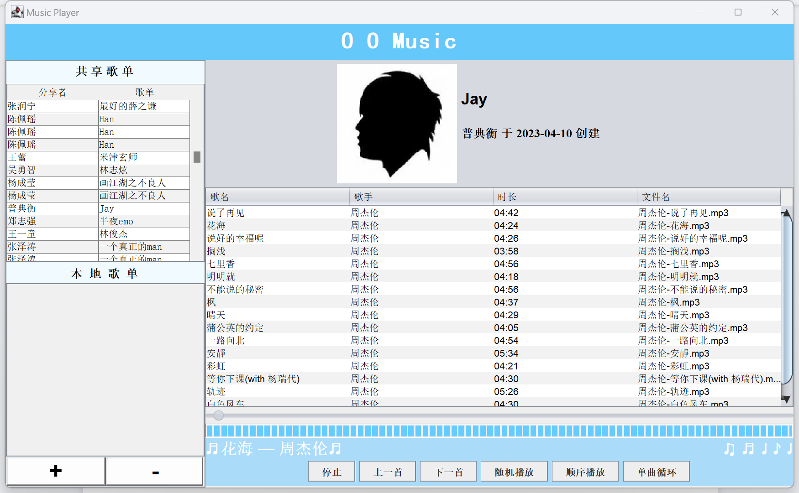

“下一首”点击后会直接切换到目前播放状态（顺序or随机）的下一首歌（“上一首”同理），同时播放提示栏也会实时更新显示正在播放的歌曲

“随机播放”参考了主流播放器的逻辑，点击后相当于给每一首歌随机赋一个id，在本次循环中都会保持这个顺序，比如歌曲1在歌曲5之后，播放到歌曲5时如果点击上一首依然是歌曲1

“随机播放”“顺序播放”“单曲循环”可随时切换

每次点击“随机播放”都会得到一个新的播放顺序

每次点击“顺序播放”都会得到原歌单的播放顺序

每次点击“单曲循环”都会让当前单曲循环播放