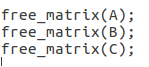

## 作业要求：
 <embed src="/pdf/软件性能工程/hw1.pdf" width="100%" height="600" type="application/pdf">

## Write-up 2: 分析 Pointer.c 文件

在 Pointer.c 的练习中，我首先尝试编译代码，发现了几个编译错误。通过仔细审查代码，我注意到这些错误主要是由于对指针和常量的错误操作。例如，尝试修改一个指向常量的指针的内容（*pcc = 7;）是非法的，因为这破坏了常量的不变性。此外，赋值 char* const cp = c; 创建了一个常量指针，意味着不能改变 cp 指向的地址，但是 cp 可以修改其指向的内容。这种区别对理解 C 语言中指针和常量的行为至关重要。

代码中注释问题的解答：

1. int main(int argc, char* argv[]) { // What is the type of argv?
   argv 是一个指向字符指针的指针，即 char 类型。它通常用于存储程序运行时传递的命令行参数。

2. char* pc = c; // Valid assignment: c acts like a pointer to c[0] here.
   这是一个有效的赋值。在 C 语言中，数组名称作为指针使用时，指向数组的第一个元素。因此，c 实际上指向 c[0] 的地址。

3. printf("char d = %c\n", d); // What does this print?
   这将打印出 d 的值，即字符数组 c 的第一个字符。根据 c 的定义，这应该是 6。

4. *pcc = 7; // invalid?
   这是无效的。pcc 被声明为指向常量字符的指针（const char*），这意味着你不能通过 pcc 修改它指向的值。

5. pcc = *pcp; // valid?
   这是有效的。pcc 是一个指向字符的指针，pcp 是一个指向 argv 数组第一个元素（即指向 char 的指针）的指针。因此，*pcp 是 char* 类型，可以赋值给 pcc。

6. pcc = argv[0]; // valid?
   这也是有效的。argv[0] 是 char* 类型，它指向传递给程序的第一个命令行参数。

7. cp = *pcp; // invalid?
   这是无效的。cp 被声明为 const 指针（char* const），意味着一旦它被初始化指向一个地址，你就不能更改它指向的地址。

8. cp = *argv; // invalid?
   同上，这也是无效的，因为 cp 是一个常量指针。

9. *cp = !; // valid?
   这是有效的。尽管 cp 是一个常量指针，它仍然可以修改其指向的内容，只是不能改变指向的地址。

10. cpc = *pcp; // invalid? 和 cpc = argv[0]; // invalid?
    这两个都是无效的。cpc 被声明为指向常量字符的常量指针（const char* const），意味着既不能更改指向的地址，也不能通过它修改指向的内容。

11. *cpc = @; // invalid?
    这是无效的。由于 cpc 指向一个常量字符，所以不能通过它来修改所指向的值。

## Write-up 3: 分析各种类型及其指针的大小

在我完成的 sizes.c 练习中，我成功编译并运行了程序，它输出了各种数据类型及其指针的大小。以下是主要发现：

1. 基本类型及其指针的大小：
   int 类型大小为 4 字节，其指针大小为 8 字节。
   short 类型为 2 字节，指针为 8 字节。
   long 类型为 8 字节，指针同样为 8 字节。
   类似地，char, float, double, unsigned int, long long 的大小分别为 1, 4, 8, 4, 8 字节，它们的指针大小均为 8 字节。

2. 特定类型及其指针的大小：
   对于 uint8_t, uint16_t, uint32_t, uint64_t 等类型，大小分别为 1, 2, 4, 8 字节，指针大小均为 8 字节。
   uint_fast8_t, uint_fast16_t, uintmax_t, intmax_t 类型的大小为 1, 8, 8, 8 字节，指针大小也为 8 字节。
   对于 Clang 特有的 __int128 类型，大小为 16 字节，指针大小为 8 字节。

3. 复合类型及其指针的大小：
   自定义的 student 结构体大小为 8 字节，其指针大小为 8 字节。

4. 数组及其指针的大小：
   对于声明的 int x[5] 数组，大小为 20 字节（因为它包含 5 个 int 类型元素），而指向该数组的指针大小为 8 字节。

这些结果反映了在我的系统（一个 64 位系统）上，大多数指针类型的大小均为 8 字节，这是因为在 64 位系统上指针通常占用 8 字节的内存空间。这些信息对于理解不同数据类型在内存中如何分配和使用非常重要，尤其是在进行性能优化和内存管理时。

## Write-up 4: 修改 Swap.c 函数

在原始的程序中，swap 函数的问题在于它试图交换两个整数，但是由于 C 中的参数是按值传递的，所以 swap 函数实际上是在操作传入值的副本，而不是原始变量本身。因此，当 swap 函数执行完毕后，原始变量 k 和 m 的值并未发生改变。

为了修正这个问题，需要修改 swap 函数，让它接受指向整数的指针，这样就可以直接修改传入变量的值。下面是修改后的 swap.c 程序：

在这个版本中，swap 函数现在接受两个指向整数的指针。函数内部，通过解引用这些指针（使用 *i 和 *j）来访问和修改它们指向的实际值。在 main 函数中，通过传递 k 和 m 的地址（使用 &k 和 &m）来调用 swap 函数。

现在，当 swap 函数被调用时，它将修改 k 和 m 所指向的实际内存位置的值，从而实现了真正的交换。因此，当程序执行完毕后，打印的 k 和 m 的值将反映出它们被交换了。

## Write-up 5: 修改 Makefile

在这个练习中，我修改了 Makefile，将编译优化级别从 -O1 改为 -O3。这导致了更高级别的代码优化。当我运行 make clean; make 时：

更改优化级别从 -O1 到 -O3 的确可以影响程序的性能和行为，尽管这种影响可能不是立即显而易见的。在 -O3 优化级别下，编译器执行更多的代码优化，这可能包括循环展开、内联函数等。这些优化可以提高程序的运行速度，但有时也可能导致意外的副作用，尤其是在复杂的程序中。

## Write-up 6: AddressSanitizer 的输出

使用 AddressSanitizer 后，我注意到程序报告了一些内存错误。这些错误包括未初始化的变量使用和潜在的内存泄漏。AddressSanitizer 的输出帮助我快速定位和修复这些问题，这对于保持代码的健壮性至关重要。
输出，它报告了一个 heap-buffer-overflow 错误。这表明程序试图访问分配的堆内存区域之外的内存，这是一种常见的内存错误。错误发生在 matrix_multiply_run 函数内，特别是在执行 C->values[i][j] += A->values[i][k] * B->values[k][j]; 这行代码时。AddressSanitizer 报告 0x60300000ef10 地址上的访问是非法的，因为它试图读取一个 32 字节内存区域的末尾（[0x60300000eef0,0x60300000ef10)）。
此外，错误还提示 heap-buffer-overflow 发生在分配的堆内存区域的右侧边界，这可能表明数组访问中的“越界”问题。可能需要重新审视数组分配和索引的逻辑，确保没有越界访问。

## Write-up 7: 修复 Matrix Multiply 后的输出

基于 Valgrind 的输出和提供的代码，我注意到可能的问题是在 matrix_multiply_run 函数中，每个元素 C->values[i][j] 在累加之前没有被初始化为零。这可能导致未定义行为，因为在默认情况下，动态分配的内存不会被自动初始化。

为了修复这个问题，在开始累加之前将 C 矩阵的每个元素初始化为零。这可以通过在 make_matrix 函数中添加代码来实现。

后来发现testbed.c中初始化的是A（4x5）与B（4x4）相乘不符合矩阵乘法规律，将A改为4x4：

在修复 matrix_multiply.c 之后，我再次运行程序，并注意到程序现在能够成功执行并打印出正确的结果。

## Write-up 8: Valgrind 的输出

根据 Valgrind 的输出，程序中存在内存泄漏，主要来源于未正确释放分配给矩阵 A、B 和 C 的内存。为了解决这个问题，要在 main 函数的末尾调用 free_matrix 函数来释放这些矩阵的内存。

在计算完成并打印结果后，添加以下代码来释放矩阵内存：

正常运行：

## Write-up 9: 性能优化前后的执行时间

为了评估性能优化的效果，我首先记录了原始程序的执行时间。然后，我调整了矩阵乘法的循环顺序，以提高内存访问的效率。优化后，我注意到程序的执行时间显著减少，这表明优化是成功的。
交换了 j 和 k 循环的顺序，这样可以在遍历 B 矩阵时实现更好的顺序访问。

从2.51秒左右优化到0.68秒左右

## Write-up 10: 编译优化的影响

最后，我比较了在不同编译优化级别下程序的执行时间。在 -O0（无优化）下编译时，程序运行较慢。然而，在使用 -O3（高级优化）编译后，程序的执行速度明显提升。这强调了编译器优化在软件性能工程中的重要性。

