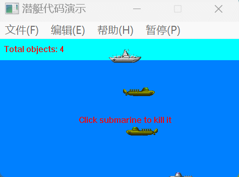
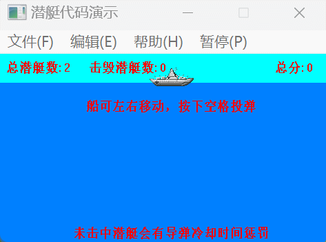

## 原版效果：
### 依靠鼠标点击去炸毁潜艇得分，类似打地鼠：



## 改编效果：
### 靠船左右移动投炸弹炸毁潜艇得分：




## 概述
本报告详细分析了《潜艇大战》游戏从原版到改编版本中的关键代码变化。原版游戏的核心玩法是使用鼠标点击来炸毁潜艇并得分，类似于“打地鼠”的游戏模式。改编版本则通过控制船的左右移动并投掷炸弹来炸毁潜艇以得分。


## 1. 核心视图类 (`CChildView`) 类分析

### 概述

`CChildView` 类是《潜艇大战》游戏的核心视图类，负责管理游戏对象、处理用户输入、绘制游戏界面等。

### `OnTimer` 方法分析

#### 创建和管理潜艇

**潜艇创建逻辑**

```cpp
if(nCreator==0)
{
    m_Objects.AddTail(new CSubmarine(random(2)%2?true:false, random(GAME_HEIGHT-SHIP_VERT_POS-SHIP_HEIGHT*2-30)+SHIP_VERT_POS+SHIP_HEIGHT+30, random(4), random(4)+3));
    nCreator = random(50) + 10;
}
```
- `nCreator` 用于控制潜艇生成的时间间隔。当它变为 0，代码会创建一个新的 `CSubmarine` 对象并将其添加到游戏对象列表 `m_Objects`。
- 每个潜艇的位置、类型和速度都是随机生成的，提供了游戏的可变性和挑战性。

**潜艇管理逻辑**

```cpp
POSITION pos1, pos2;
for(pos1=m_Objects.GetHeadPosition(); (pos2=pos1)!=NULL;)
{
    if(((CMyObject*)m_Objects.GetNext(pos1))->Draw(&m_VirtualDC, m_bGamePause))
    {
        pLastObj = m_Objects.GetAt(pos2);
        m_Objects.RemoveAt(pos2);
        delete pLastObj;
    }
}
```
- 这段代码遍历 `m_Objects` 中的所有游戏对象，并对它们调用 `Draw` 方法。
- 如果 `Draw` 方法返回 `true`，表明对象（如潜艇）需要被移除。这通常在对象（如潜艇被击中或移动出屏幕）结束其生命周期时发生。

#### 游戏画面渲染

**背景绘制**

```cpp
m_VirtualDC.FillSolidRect(0, 0, GAME_WIDTH, SHIP_VERT_POS+SHIP_HEIGHT-5, SKY_COLOR);
m_VirtualDC.FillSolidRect(0, SHIP_VERT_POS+SHIP_HEIGHT-5, GAME_WIDTH, GAME_HEIGHT, SEA_COLOR);
```
- 这里使用 `FillSolidRect` 在虚拟设备上下文 `m_VirtualDC` 上绘制天空和海洋背景。
- `SKY_COLOR` 和 `SEA_COLOR` 定义了天空和海洋的颜色。

**最终渲染到屏幕**

```cpp
dc.BitBlt(0, 0, GAME_WIDTH, GAME_HEIGHT, &m_VirtualDC, 0, 0, SRCCOPY);
```
- 使用 `BitBlt` 方法将虚拟设备上下文的内容传输到实际的屏幕上下文。
- 这种方法可以避免闪烁并提高绘图效率。

#### 其他重要逻辑

**游戏暂停功能**

```cpp
if(m_bGamePause) return;
```
- 控制游戏暂停。当 `m_bGamePause` 为 `true` 时，`OnTimer` 将提前返回，不执行任何游戏更新逻辑。

**潜艇生成计数器更新**

```cpp
nCreator--;
```
- `nCreator` 每次 `OnTimer` 被调用时递减，控制潜艇的生成频率。

总结来说，`OnTimer` 方法是游戏的心脏，负责潜艇的生成和管理、游戏画面的更新和渲染，以及控制游戏的暂停和继续。这个方法充分展示了游戏循环的典型结构，包括对象管理、状态更新和画面渲染。


## 2. 潜艇类 (`CSubmarine`) 的变更

### 原版
在原版中，`CSubmarine` 类主要负责潜艇的初始化、移动、绘图和销毁。这个类使用了 `CImageList` 来处理潜艇的图像。潜艇的移动是基于它们的方向 (`m_bDirect`) 和速度 (`m_nSpeed`)。

```cpp
CSubmarine::CSubmarine(bool bDir, int nVert, int nType, int nSpeed)
{
    m_bDirect = bDir;
    m_ptPos.x = m_bDirect ? GAME_WIDTH : -SUBMARINE_WIDTH;
    m_ptPos.y = nVert;
    // ...[其他初始化代码]...
}
```

### 改编版本
在改版中，`CSubmarine` 类增加了 `GetRect()` 方法，用于获取潜艇的碰撞箱。这是为了适应游戏中的新机制，如导弹与潜艇的碰撞检测。

```cpp
CRect CSubmarine::GetRect() const {
    // ...[定义矩形尺寸]...
    return CRect(m_ptPos.x, m_ptPos.y, m_ptPos.x + SubmarineWidth, m_ptPos.y + SubmarineHeight);
}
```


## 3. 新增导弹类 (`CMissile`)
在改编版本中，新增了导弹类 `CMissile`。这一变化扩展了游戏的交互性和复杂度。

### 原版
原版游戏中没有导弹类的概念。

### 改编版本
改编版本中添加了 `CMissile` 类，并在主游戏循环中处理导弹的移动和碰撞检测。

```cpp
if (typeid(*pObj) == typeid(CMissile))
{
    CMissile* pMissile = (CMissile*)pObj;
    pMissile->Move(); // 移动导弹
    // ... [碰撞检测和处理代码] ...
}
```
- **构造函数**：初始化导弹的位置和生命周期。
  
  ```cpp
  CMissile::CMissile(CPoint ptPos) : CMyObject(ptPos)
  {
      m_nLifetime = 0;
      // ...[初始化代码]...
  }
  ```

- **`Move` 方法**：控制导弹的移动。

  ```cpp
  void CMissile::Move()
  {
      m_ptPos.y += 20;  // ...[移动逻辑]...
  }
  ```

- **`GetRect` 方法**：为碰撞检测提供导弹的矩形区域。

  ```cpp
  CRect CMissile::GetRect() const {
      // ...[定义矩形尺寸]...
      return CRect(m_ptPos.x, m_ptPos.y, m_ptPos.x + MissileWidth, m_ptPos.y + MissileHeight);
  }
  ```

- **导弹图像处理**：使用 GDI+ 从资源加载 PNG 图片并创建图像列表。

  ```cpp
  BOOL CMissile::LoadImage()
  {
      // ...[加载和处理 PNG 图片的代码]...
  }
  ```
  
  
  
## 4. 控制机制的改变
### 原版
原版游戏中，玩家通过鼠标点击潜艇位置来摧毁它们。这是通过 `OnLButtonDown` 函数实现的：

```cpp
void CChildView::OnLButtonDown(UINT nFlags, CPoint point) 
{
    // ... [代码省略] ...
    if(pSub->GetRect().PtInRect(point))
    {
        // 创建爆炸和计分
        // ... [代码省略] ...
        delete pSub;
    }
    // ... [代码省略] ...
}
```

### 改编版本
改编版本引入了键盘控制。通过 `OnKeyDown` 函数，玩家可以通过左右键移动船，并用空格键发射导弹。

```cpp
void CChildView::OnKeyDown(UINT nChar, UINT nRepCnt, UINT nFlags)
{
    // ... [代码省略] ...
    else if (nChar == VK_SPACE || nChar == VK_RETURN) // 发射导弹
    {
        // ... [代码省略] ...
        if (!missileExists)
        {
            CMissile* pMissile = new CMissile(CPoint(shipPos.x, SHIP_VERT_POS));
            m_Objects.AddTail(pMissile);
        }
    }
    // ... [代码省略] ...
}
```


## 5. 分数统计的变更
为了适应新的游戏玩法，分数统计方式也做了调整。

### 原版
原版游戏仅在鼠标点击潜艇时计分。

### 改编版本
改编版本中，分数统计不仅包括击毁潜艇的分数，还统计了击毁的潜艇数量。

```cpp
m_nTotalScore += pScore->GetScoreValue(); // 累加分数
++m_nDestroyedSubmarines;  // 增加被击毁的潜艇数量
```


## 6. 界面信息显示的改进
改编版本在界面上添加了更多的信息显示，如总潜艇数、击毁潜艇数等，增强了游戏的可玩性和信息反馈。

```cpp
CString destroyedString;
destroyedString.Format("击毁潜艇数: %d", m_nDestroyedSubmarines);
m_VirtualDC.TextOut(130, 10, destroyedString); // 显示击毁潜艇数

CString scoreString;
scoreString.Format("总分: %d", m_nTotalScore);
m_VirtualDC.TextOut(GAME_WIDTH - 100, 10, scoreString); // 显示总分
```


## 结论

参与《潜艇大战》游戏的改编过程，我在游戏开发方面获得了实质性的技能提升。通过这个项目，我学到了以下几个关键的技术点：

1. **交互控制的实现**：通过替换原有的鼠标点击控制为键盘控制，我学会了如何处理和响应键盘事件。这提高了我的能力，使我能够在未来的项目中灵活地设计和实现用户交互。
2. **游戏逻辑的编写**：在实现导弹发射和移动的逻辑时，我加深了对游戏循环和对象状态管理的理解。这对于理解如何构建游戏的动态元素和保持其连贯性非常有帮助。
3. **碰撞检测的处理**：实现导弹和潜艇之间的碰撞检测增强了我在游戏物理和交互方面的技术知识，这在很多游戏开发项目中都是一个核心技能。
4. **图形和用户界面的更新**：改进游戏的界面显示，例如增加得分和击毁潜艇数的显示，让我更加熟悉了图形界面的编程和数据可视化。