## 1. 项目概述


   - 项目名称：《让蛋仔飞》

   - 开发者：普典衡

   - 分工：

     普典衡：

     策划-玩法，数值

     程序-前端，后端

     美术-UI，动画

## 2. 游戏内容介绍

   - 游戏背景：一个简单而有趣的游戏环境，主要集中于轻松、快节奏的体验。
   - 角色道具：玩家扮演的是不同种类的卡通蛋角色，如荷包蛋、倒霉蛋等。卡通风格的刀和叉作为障碍物。
   - 场景：使用明亮、鲜艳的色调和简单的卡通风格，界面清晰展示游戏选项。
   - 主要情节：游戏集中于提供快节奏、直观易懂的体验，没有复杂的情节或故事线。
   - 玩法：操作主角蛋躲避障碍物，通过点击或触摸屏幕控制跳跃。
   - 功能（系统）：包括游戏控制系统、皮肤系统、排行榜系统等。

## 3. 主要特点

   - 整体风格：简洁而有趣，易于上手。
   - 娱乐性与挑战性：结合逐渐增加的难度提供持续挑战。
   - 社交性：通过排行榜系统增加游戏的社交动力。
   - 个性化体验：通过皮肤系统允许玩家自定义角色外观。

## 4. 算法说明

   Unity（C#）代码部分：

### 游戏控制和角色行为

#### `EggyController` 类：
   负责处理蛋角色的基本行为，包括跳跃、得分、游戏开始/结束逻辑、无敌状态、碰撞处理以及游戏速度的调整。

##### 游戏开始/结束逻辑

   ```C#
       void Update() {
           if (isControl && !IsPointerOverUIObject()) {
               if (Input.GetMouseButtonDown(0) && !gameStarted) {
                   StartGame();
               } else if (gameStarted) {
                   Jump();
               }
               CheckPosition();
           }
       }
       
       void StartGame() {
           gameStarted = true;
           Time.timeScale = 1; // 恢复时间流逝
           // 其他游戏开始逻辑
       }
       
       void CheckPosition() {
           // 检查蛋的位置，确定游戏是否结束
           // 如果蛋落出屏幕，则结束游戏
       }
   ```

   此部分代码控制游戏的开始和结束。当玩家点击屏幕时，游戏开始，而当游戏角色掉出屏幕时，游戏结束。

##### 跳跃逻辑

   ```C#
       void Jump() {
           if (Input.GetMouseButtonDown(0)) {
               rb.velocity = Vector2.up * jumpForce;
               StartCoroutine(BounceEffect());
           }
       }
       
       IEnumerator BounceEffect() {
           // 实现蛋的跳跃动画效果
       }
   ```

   这段代码负责处理玩家角色的跳跃动作。玩家点击屏幕时，角色会向上跳跃。

##### 得分逻辑

   ```C#
       void OnTriggerEnter2D(Collider2D other) {
           if (!isGameOver && other.gameObject.tag == "ScoreZone") {
               score++;
               UpdateScoreText();
           }
       }
       
       void UpdateScoreText() {
           scoreText.text = score.ToString();
       }
   ```

   当角色通过特定区域时，玩家得分。这通过检测角色是否触碰到标记为 "ScoreZone" 的触发器来实现。

##### 无敌状态

   ```C#
       IEnumerator InvincibilityTime() {
           isInvincible = true;
           // 实现无敌状态效果，如闪烁等
           yield return new WaitForSeconds(3); // 无敌时间
           isInvincible = false;
       }
   ```

   在某些情况下，角色会进入无敌状态，这段时间内不会被障碍物伤害。

##### 碰撞处理

   ```C#
       void OnCollisionEnter2D(Collision2D collision) {
           if (collision.gameObject.tag == "KF" && !isGameOver && !isInvincible) {
               iscollide = true;
               StartCoroutine(HandleGameOver());
           }
       }
   ```

   当角色与标记为 "KF" 的障碍物发生碰撞时，游戏结束逻辑被触发。

##### 游戏速度调整

   ```C#
       void UpdateGameSpeed() {
           Time.timeScale = Mathf.Min(1 + score * speedupspeed, maxTimeScale);
       }
   ```

   随着玩家得分的提高，游戏的时间流逝速度加快，从而增加游戏难度。

#### `Background` 类：
   管理游戏背景的移动，以创建滚动效果，增加游戏的动态感。

##### 初始化背景属性

   ```csharp
        void Start() {
            backgroundWidth = GetComponent<SpriteRenderer>().bounds.size.x;
        }
   ```
   在游戏开始时，计算背景图像的宽度，以便于后续确定何时克隆新的背景。

##### 背景移动逻辑

   ```csharp
        void Update() {
            if (!EggyController.isGameOver) {
                transform.Translate(-speed * Time.deltaTime, 0, 0);
            }
        }
   ```
   在每一帧中，如果游戏未结束，背景将以设定的速度向左移动，创建出持续滚动的效果。

##### 背景克隆和销毁

   ```csharp
        if (transform.position.x < 0 && !hasCloned) {
            CloneBackground();
            hasCloned = true;
        }
        if (transform.position.x < -18) {
            Destroy(gameObject);
        }
   ```
   当背景移动到屏幕中央时，克隆一个新的背景对象，以实现无缝连接的滚动效果。一旦背景移出屏幕一定范围，它将被销毁，以节省资源。

##### 克隆背景方法

   ```csharp
        void CloneBackground() {
            Instantiate(gameObject, new Vector3(transform.position.x + backgroundWidth, transform.position.y, transform.position.z), Quaternion.identity);
        }
   ```
   这个方法在原有背景的基础上创建一个新的背景实例，放置在当前背景的右侧，确保两个背景图像在水平方向上连续。


### 游戏界面和用户交互

#### `MenuManager` 类：
   管理游戏菜单的显示和皮肤选择，提供玩家选择不同皮肤的功能。

##### 初始化和皮肤状态管理

   ```csharp
        public void Start() {
            // 确保主页UI初始时是显示的
            gameElements.SetActive(false);
            homePageUI.SetActive(true);
            // 获取并显示累计总得分
            int totalScore = PlayerPrefs.GetInt("TotalScore", 0);
            // 获取并显示死亡次数
            int deathCount = PlayerPrefs.GetInt("DeathCount", 0);
            // 获取并显示复活总数
            int resurrectionCount = PlayerPrefs.GetInt("ResurrectionCount", 0);
        
            // 在对应的Text组件中显示这些值
            // 这里假设你有三个Text组件分别用于显示总得分、死亡次数和复活总数
            // 如果你的Text组件命名不同，需要根据实际情况修改下面的代码
            totalScoreText.text = "总得分: " + totalScore.ToString();
            deathCountText.text = "失败数: " + deathCount.ToString();
            resurrectionCountText.text = "复活数: " + resurrectionCount.ToString();
        
            Time.timeScale = 1;
            gameElements.SetActive(true); // 先激活
            ApplySkinToEggy(skinManager.skins[PlayerPrefs.GetInt("eggy", 0)].name); // 应用皮肤
            gameElements.SetActive(false); // 再隐藏，如果需要的话

        
            // 初始化皮肤列表
            InitializeSkinsUnlockState();
            LoadCurrentSkin();
            UpdateEggyDisplay(skinManager.skins[currentSkinIndex]);
        
            unlockButton.gameObject.SetActive(false);
            selectButton.gameObject.SetActive(false);
        }
        
        private void InitializeSkinsUnlockState() {
            // 默认皮肤已解锁
            PlayerPrefs.SetInt("eggy0", 1); // 1表示解锁，0表示未解锁
        
            // 其他皮肤的初始状态
            for (int i = 1; i < skinManager.skins.Count; i++)
            {
                if (!PlayerPrefs.HasKey("eggy" + i))
                {
                    PlayerPrefs.SetInt("eggy" + i, 0); // 初始化为未解锁
                }
                if (!PlayerPrefs.HasKey("eggyUnlockable" + i))
                {
                    PlayerPrefs.SetInt("eggyUnlockable" + i, 0); // 初始化为不能解锁
                }
        
            }
        }
        
        private void LoadCurrentSkin() {
            // 读取当前皮肤
            currentSkinIndex = PlayerPrefs.GetInt("eggy", 0);
                    			           UpdateEggyDisplay(skinManager.skins[currentSkinIndex]);
        }
   ```
   这部分代码在游戏开始时初始化UI元素和皮肤状态，包括设置默认皮肤和加载已解锁的皮肤。

##### 游戏开始和皮肤应用

   ```csharp
        public void StartGame() {
            Time.timeScale = 0;
            // 激活游戏元素
            gameElements.SetActive(true);
        
            // 隐藏主页UI
            homePageUI.SetActive(false);
        
            // 其他开始游戏的设置...
        }
        
        public void ApplySkinToEggy(string skinName) {
            Skin skin = skinManager.GetSkin(skinName);
            if (skin != null)
            {
                EggyController eggyController = Object.FindObjectOfType<EggyController>();
                if (eggyController != null)
                {
                    eggyController.ChangeAppearance(skin.image);
                }
                else
                {
                    Debug.LogError("EggyController instance not found in the scene.");
                }
            }
        }
   ```
   当玩家选择开始游戏时，这部分代码负责切换游戏的视图状态，并应用玩家选择的皮肤。

##### 皮肤选择和解锁

   ```csharp
        public void NextSkin() {
            currentSkinIndex = (currentSkinIndex + 1) % skinManager.skins.Count;
            UpdateEggyDisplay(skinManager.skins[currentSkinIndex]);
        }
        
        public void PreviousSkin() {
            currentSkinIndex = (currentSkinIndex - 1 + skinManager.skins.Count) % skinManager.skins.Count;
            UpdateEggyDisplay(skinManager.skins[currentSkinIndex]);
        }
        
        public void SelectSkin() {
            PlayerPrefs.SetInt("eggy", currentSkinIndex); // 保存当前选择的皮肤
            gameElements.SetActive(true); // 先激活
            ApplySkinToEggy(skinManager.skins[currentSkinIndex].name);//应用皮肤
            gameElements.SetActive(false); // 再隐藏，如果需要的话
            selectButton.gameObject.SetActive(false);
        }
        
        public void UnlockSkin() {
            bool canUnlock = false;
        
            switch (currentSkinIndex)
            {
                case 1: // eggy1解锁条件 - 累计失败500次
                    int deathCount = PlayerPrefs.GetInt("DeathCount",0);
                    canUnlock = deathCount >= 500;
                    break;
                case 2: // eggy2解锁条件 - 累计达到10000分
                    int totalScore = PlayerPrefs.GetInt("TotalScore",0);
                    canUnlock = totalScore >= 10000;
                    break;
                case 3: // eggy3解锁条件 - 累计复活50次
                    int resurrectionCount = PlayerPrefs.GetInt("ResurrectionCount", 0);
                    canUnlock = resurrectionCount >= 50;
                    break;
                case 4:
                case 5:
                case 6:
                    if (PlayerPrefs.GetInt("eggyUnlockable" + currentSkinIndex, 0) == 1)
                    {
                        canUnlock = true;
                    }
                    break;
                default:
                    break;
            }
        
            if (canUnlock)
            {
                PlayerPrefs.SetInt("eggy" + currentSkinIndex, 1); // 解锁当前皮肤
                skinManager.skins[currentSkinIndex].isUnlocked = true; // 更新皮肤管理器中的状态
                UpdateEggyDisplay(skinManager.skins[currentSkinIndex]);
            }
            else
            {
                StartCoroutine(ShowUnlockConditionFailed());
            }
        }
        
        private void UpdateEggyDisplay(Skin skin) {
            // 更新皮肤信息
            NameText.text = skin.name;
            IntroductionText.text = skin.description;
            unlockConditionText.text = skin.unlockCondition;
        
            // 保存原始皮肤图像并重置Eggy
            eggyDisplay.SetSkinImage(skin.image);
            eggyDisplay.ResetEggy(); // 重置Eggy的位置和状态
        
            // 获取解锁和选中状态
            bool isUnlocked = PlayerPrefs.GetInt("eggy" + currentSkinIndex, 0) == 1;
            bool isSelected = PlayerPrefs.GetInt("eggy", 0) == currentSkinIndex;
        
            // 根据解锁状态和选中状态控制按钮显示
            if (isUnlocked && isSelected)
            {
                // 当前皮肤已解锁且为当前选中皮肤
                unlockButton.gameObject.SetActive(false);
                selectButton.gameObject.SetActive(false);
            }
            else if (isUnlocked)
            {
                // 当前皮肤已解锁但不是当前选中皮肤
                unlockButton.gameObject.SetActive(false);
                selectButton.gameObject.SetActive(true);
            }
            else
            {
                // 当前皮肤未解锁
                unlockButton.gameObject.SetActive(true);
                selectButton.gameObject.SetActive(false);
            }
        
            eggyDisplay.SetUnlocked(isUnlocked);
        }
   ```
   这些方法允许玩家在不同皮肤之间选择和切换，并根据游戏进度解锁新的皮肤。


#### `EggyDisplay` 类：用于控制蛋角色在游戏中的显示，包括皮肤更换和解锁动画效果。

##### 初始化和设置皮肤

   ```csharp
        private void Start() {
            eggyRenderer = GetComponent<SpriteRenderer>();
            originalSprite = eggyRenderer.sprite;
            originalPosition = transform.position;
            originalScale = transform.localScale;
        }
        
        public void SetSkinImage(Sprite skinImage) {
            originalSprite = skinImage;
            eggyRenderer.sprite = skinImage;
        }
   ```
   在游戏开始时，该类初始化蛋角色的渲染器，并保存其原始状态。`SetSkinImage` 方法用于更换角色的皮肤。

##### 皮肤解锁动画

   ```csharp
        public void SetUnlocked(bool unlocked) {
            if (unlocked) {
                StartCoroutine(UnlockedAnimation());
            } else {
                eggyRenderer.sprite = ApplyBlackMask(eggyRenderer.sprite);
            }
        }
        
        private IEnumerator UnlockedAnimation() {
            // 动画效果，如呼吸效果和跳跃动画
        }
   ```
   通过 `SetUnlocked` 方法，可以控制是否展示皮肤解锁动画。如果皮肤已解锁，会播放一个特殊的动画效果，如呼吸和跳跃动作。

##### 辅助方法：黑色遮罩和重置状态

   ```csharp
        private Sprite ApplyBlackMask(Sprite originalSprite) {
            // 将黑色遮罩应用于未解锁的皮肤图像
        }
        
        public void ResetEggy() {
            StopAllCoroutines();
            transform.localScale = originalScale;
            transform.position = originalPosition;
            // 重置其他状态
        }
   ```
   `ApplyBlackMask` 方法用于给未解锁的皮肤添加一个黑色遮罩，而 `ResetEggy` 方法则用于重置蛋角色的状态，包括位置和缩放。


### 游戏障碍物和挑战

#### `KnifeForkController` 和 `KFController` 类：
   负责生成和管理刀叉障碍物，控制它们的出现频率、速度和运动。

#### `KnifeForkController` 类：
   负责刀叉障碍物的生成和管理

##### 初始化和生成刀叉

   ```csharp
          public GameObject knifeForkPrefab; // 刀叉预制体
          public float spawnRate = 2f; // 生成间隔（秒）
          
          void Start() {
              nextSpawnTime = Time.time + spawnRate; // 设置下一次生成时间
          }
          
          void Update() {
              if (!isGameOver && Time.time >= nextSpawnTime)
              {
                  SpawnKnifeFork();
                  nextSpawnTime = Time.time + spawnRate;
                  forksCount++; // 增加已生成的刀叉数量
              }
          
              // 检查EggyController的游戏结束状态
              if (EggyController.isGameOver)
              {
                  isGameOver = true;
                  GameOver();
              }else isGameOver = false;
          }
          
          void SpawnKnifeFork()
          {
              float gapY = Random.Range(-gapSize, gapSize); // 随机间隔
              Quaternion rotation = Random.Range(0, 2) == 0 ? Quaternion.identity : Quaternion.Euler(0, 0, 180); // 随机旋转180度
              Vector3 spawnPosition = new Vector3(transform.position.x, gapY, transform.position.z);
          
              // 根据旋转来设置初始速度方向
              float initialMoveDirection = (rotation == Quaternion.identity) ? 1 : -1;
          
              GameObject newKnifeFork = Instantiate(knifeForkPrefab, spawnPosition, rotation);
              spawnedForks.Add(newKnifeFork); // 将已生成的刀叉添加到列表
              StartCoroutine(MoveAndDestroyKnifeFork(newKnifeFork, initialMoveDirection)); // 设置移动速度并在移出屏幕后销毁
          }
   ```

##### 刀叉运动和销毁

   ```csharp
          IEnumerator MoveAndDestroyKnifeFork(GameObject knifeFork, float initialMoveDirection) {
              // 控制刀叉的移动和销毁
          }
          
          void StopKnifeFork(GameObject knifeFork) {
              if (knifeFork != null) // 检查刀叉是否为null
              {
                  Rigidbody2D kfRigidbody = knifeFork.GetComponent<Rigidbody2D>();
                  kfRigidbody.velocity = Vector2.zero; // 停止刀叉的速度
              }
          }
   ```

##### 游戏结束和重置

   ```csharp
          public void GameOver() {
              isGameOver = true;
              // 停止所有已生成的刀叉的移动
              foreach (GameObject fork in spawnedForks)
              {
                  StopKnifeFork(fork);
              }
          }
          
          public void ResetGame() {
              // 重置刀叉控制器的状态
              isGameOver = false;
              forksCount = 0;
              nextSpawnTime = Time.time + spawnRate;
          
              // 销毁所有已生成的刀叉
              foreach (GameObject fork in spawnedForks)
              {
                  Destroy(fork);
              }
              spawnedForks.Clear(); // 清空列表
          }
   ```

#### `KFController` 类：
   负责单个刀叉障碍物的行为

##### 刀叉障碍物的物理行为

   ```csharp
          public float kfFallSpeed = 20f; // KF的下降速度
          
          void OnCollisionEnter2D(Collision2D collision) {
              if (collision.gameObject.CompareTag("eggy")) {
                  Rigidbody2D kfRigidbody = GetComponent<Rigidbody2D>();
                  kfRigidbody.velocity = Vector2.down * kfFallSpeed; // 设置下降速度
                  kfRigidbody.gravityScale = 3; // 调整重力影响
              }
          }
   ```

   `KnifeForkController` 类负责控制整体刀叉障碍物的生成频率和运动模式，而 `KFController` 类则专注于单个刀叉障碍物的具体行为，如碰撞时的下降速度和重力设置。这两个类通过协同工作，为游戏增添挑战性和动态性。

### 排行榜和社交功能

#### `Ranking` 类：
   整合微信小程序的排行榜功能，允许玩家查看和分享他们的得分。

##### 初始化和设置

   ```csharp
        void Start() {
            WX.InitSDK((code) => { Init(); });
            WX.UpdateShareMenu(new UpdateShareMenuOption() {
                withShareTicket = true,
                isPrivateMessage = true,
            });
        }
   ```
   游戏启动时初始化微信SDK，并设置分享菜单选项，允许通过群分享获取排行榜数据。

##### 展示排行榜
   ```csharp
        void ShowOpenData() {
            RankMask.SetActive(true);
            RankingBox.SetActive(true);
            WX.ShowOpenData(RankBody.texture, /* 确定排行榜的位置和尺寸 */);
        }
        
        void Init() {
            ShowButton1.onClick.AddListener(ShowRanking);
            ShowButton2.onClick.AddListener(ShowRanking);
        }
        
        void ShowRanking() {
            ShowOpenData();
            OpenDataMessage msgData = new OpenDataMessage { type = "showFriendsRank" };
            WX.GetOpenDataContext().PostMessage(JsonUtility.ToJson(msgData));
        }
   ```
   提供了按钮监听器来展示排行榜，通过调用`WX.ShowOpenData`方法将排行榜数据渲染到指定的UI元素上。

##### 排行榜的隐藏与分享
   ```csharp
        RankMask.GetComponent<Button>().onClick.AddListener(() => {
            RankMask.SetActive(false);
            RankingBox.SetActive(false);
            WX.HideOpenData();
        });
        
        ShareButton.onClick.AddListener(() => {
            // 分享最高分数
            WX.ShareAppMessage(/* 分享配置 */);
        });
   ```
   包含隐藏排行榜和分享玩家成绩的逻辑。玩家可以通过点击按钮来关闭排行榜视图，或者通过另一个按钮分享自己的最高得分。


- 使用微信SDK进行社交互动和数据共享。

##### 玩家数据和成就

- 使用 `PlayerPrefs` 来保存和加载玩家的分数、皮肤状态、死亡次数等信息。
- 提供复活机制，增加游戏的挑战性和可玩性。

##### 皮肤系统和个性化

#### `SkinManager` 类：
   管理游戏中的皮肤系统，包括皮肤的解锁条件和状态。

##### 皮肤定义

   ```csharp
        [System.Serializable]
        public class Skin
        {
            public string name; // 皮肤名称
            public Sprite image; // 皮肤图片
            public string description; // 皮肤简介
            public string unlockCondition; // 解锁条件描述
            public bool isUnlocked; // 是否已解锁
        }
   ```
   定义了一个`Skin`类，包含皮肤的名称、图片、描述和解锁条件。`isUnlocked`字段用于追踪皮肤的解锁状态。

##### 皮肤管理
   ```csharp
        public class SkinManager : MonoBehaviour
        {
            public List<Skin> skins; // 皮肤集合
        
            // 获取指定名称的皮肤
            public Skin GetSkin(string skinName) {
                return skins.Find(skin => skin.name == skinName);
            }
        }
   ```
   `SkinManager`类包含一个皮肤集合，提供`GetSkin`方法以根据名称获取特定皮肤的详细信息。这使得游戏能够根据玩家的选择或游戏进度，显示或更换皮肤。
    
   - 提供多种皮肤供玩家解锁和选择，增加游戏的个性化和吸引力。

## 5. API的使用

### 系统信息和日志管理
   - `wx.getUpdateManager()`：获取全局唯一的版本更新管理器，用于管理小程序的更新。
   - `wx.getSystemInfoSync()`：同步获取系统信息，如屏幕大小、设备型号等。
   - `wx.getRealtimeLogManager()`：获取实时日志管理器，用于记录和上报实时日志。
   - `wx.getLogManager()`：获取日志管理器，用于记录和上报日志。
### 错误处理和内存管理
   - `wx.onError()`：监听小程序错误事件，用于错误处理。
   - `wx.triggerGC()`：触发JavaScript垃圾回收机制，可以帮助小程序管理内存使用。
### 用户界面和反馈
   - `wx.showModal()`：显示模态对话框，用于向用户显示信息或询问用户决策。
   - `wx.createFeedbackButton()`：创建一个游戏内的用户反馈按钮。
### 社交功能和消息传递
   - `wx.shareMessageToFriend()`：分享消息给微信好友，增强游戏的社交互动性。
   - `wx.onMessage()`：监听主域向开放数据域发送的消息，常用于排行榜的实现。
### 数据存储
   - `wx.getStorageSync()`、`wx.setStorage()`、`wx.removeStorage()`、`wx.clearStorage()`、`wx.getStorage()`：这些API用于本地数据的存取、删除和清除，方便游戏保存玩家的游戏进度、设置或成就。

## 6. UI和截图

   所有素材均为ChatGPT绘制+本人Photoshop制作，无商用素材盗用

### 游戏界面截图

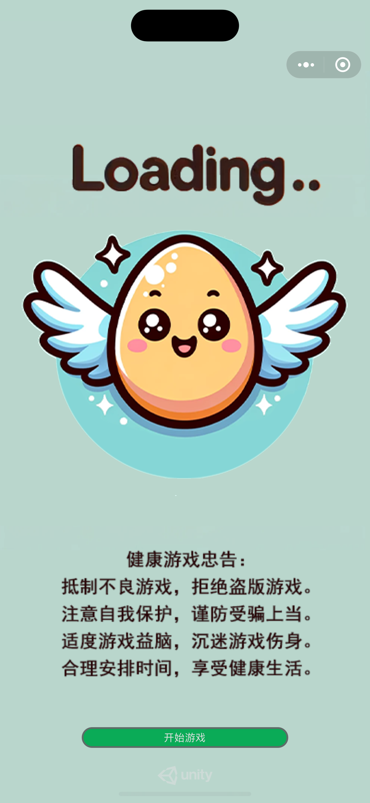

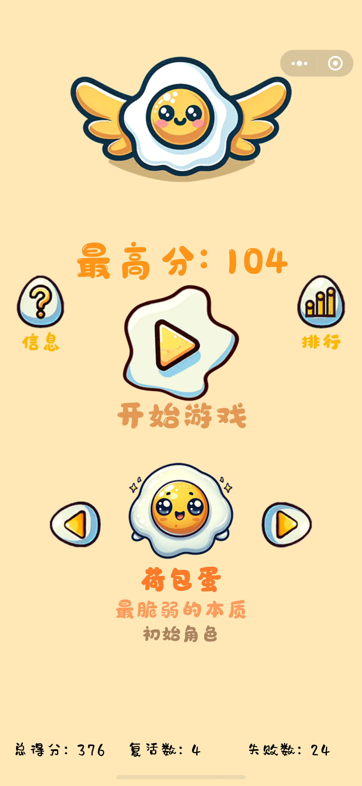

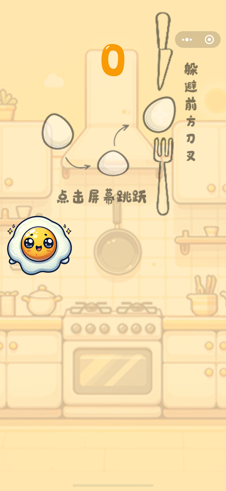
    
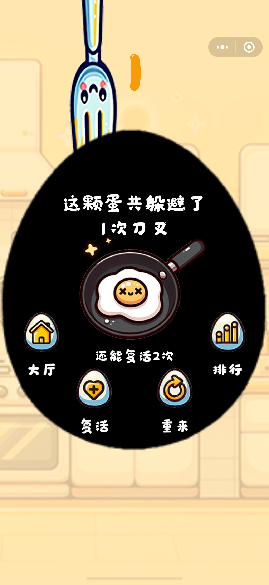
    
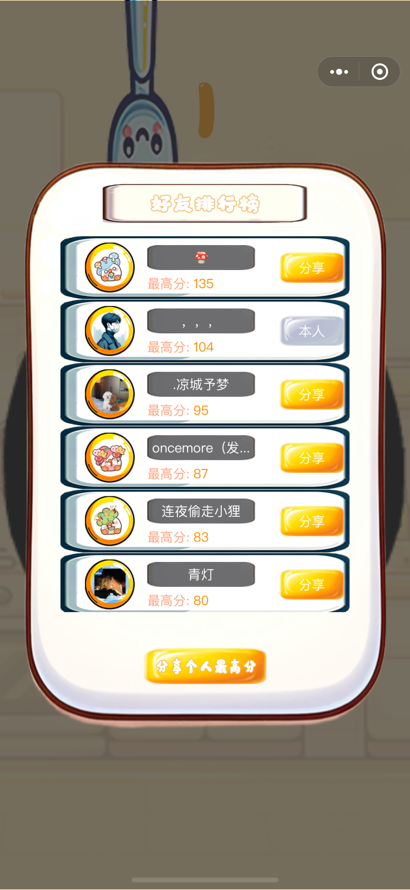
    
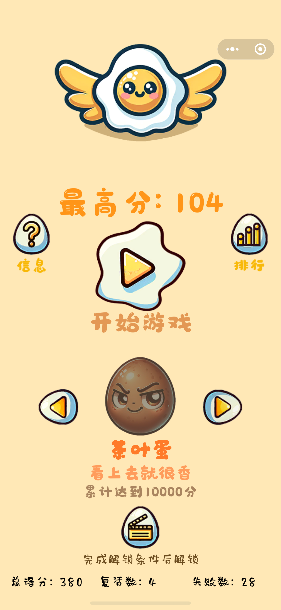

### 角色和UI设计图（部分）


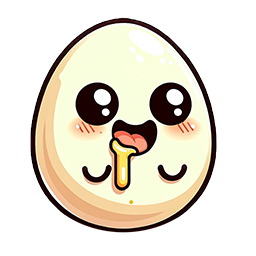
    
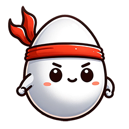
    
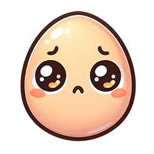
    
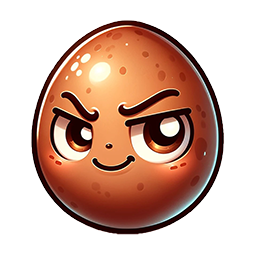
    
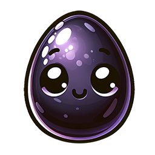
    
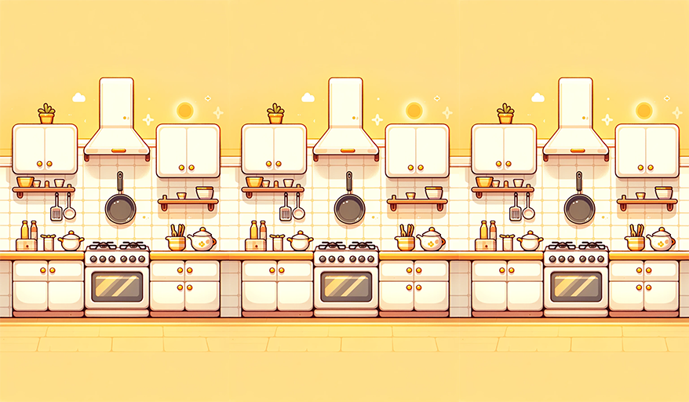
    
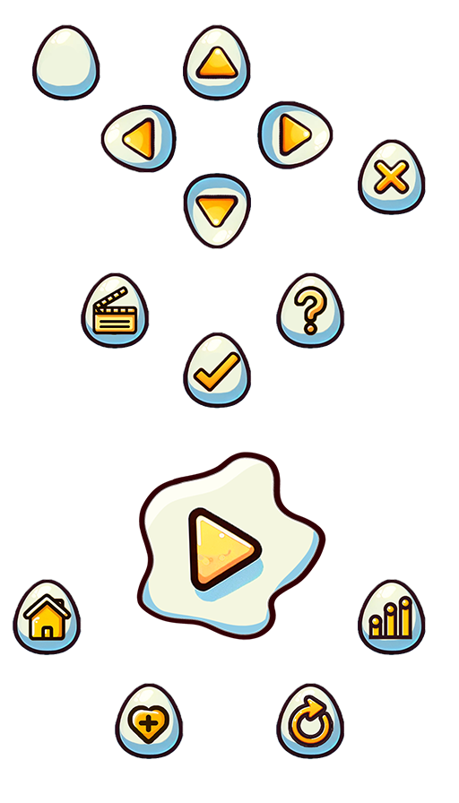
    
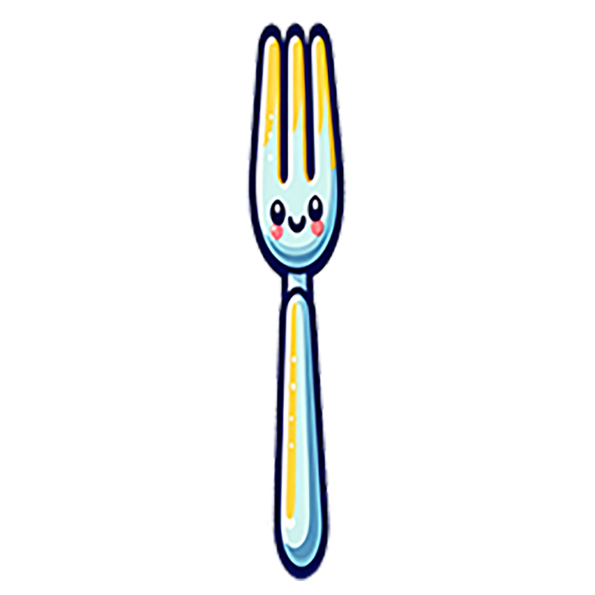
    
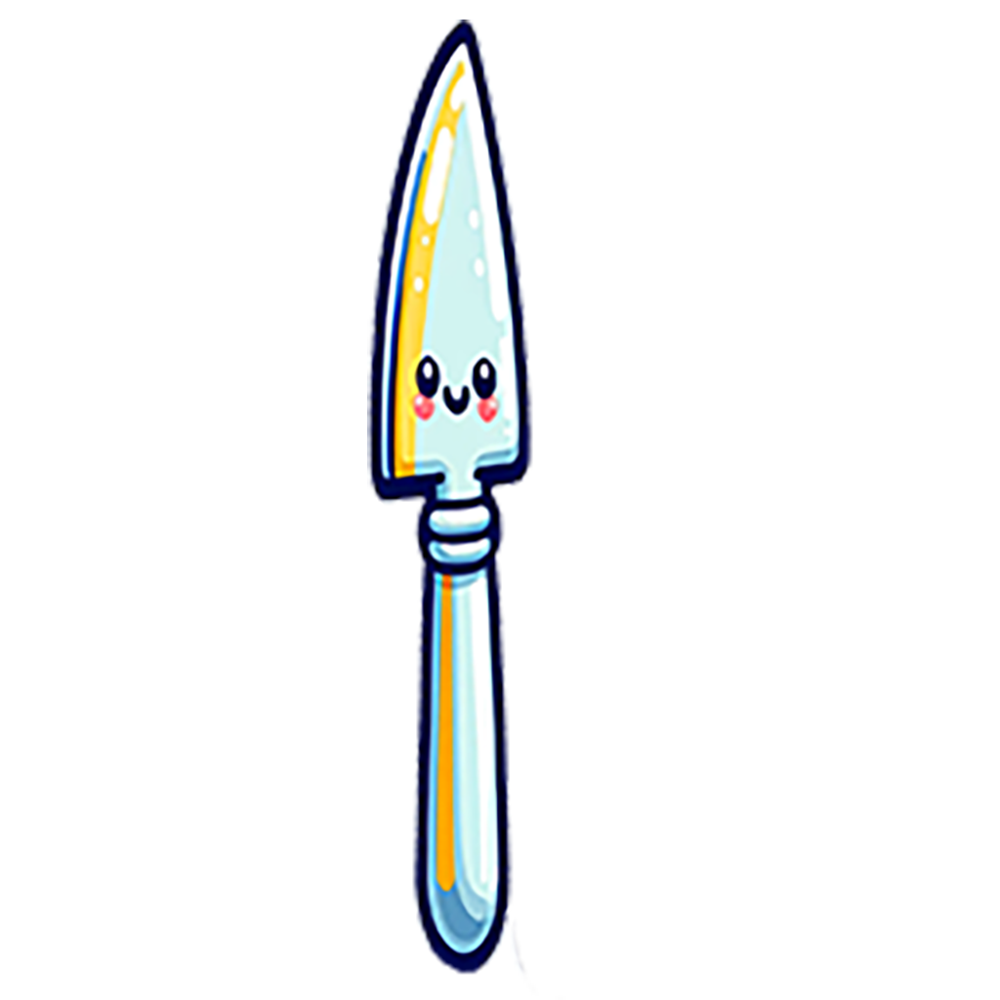
    
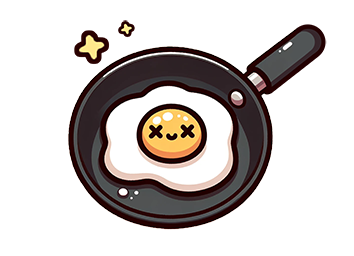

